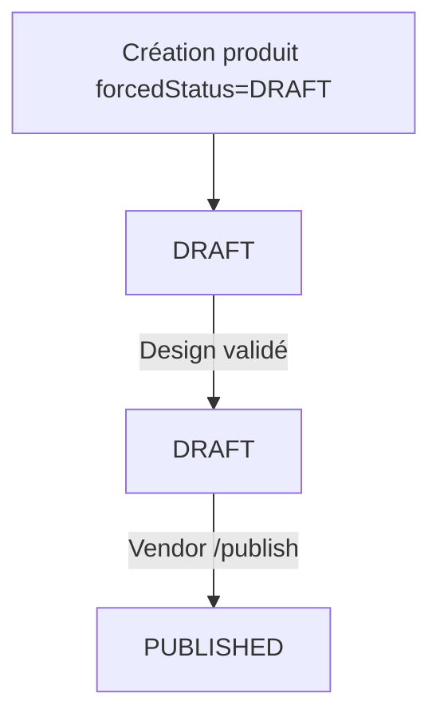

# 📋 Correctif Backend – Workflow « Brouillon »

## 🎯 Objectif

Garantir qu’un produit créé avec :

```jsonc
{
  "forcedStatus": "DRAFT",
  "isValidated": false   // design en attente
}
```

soit :

* immédiatement enregistré avec **status = `DRAFT`** ;
* conservé en **DRAFT** même lorsque le design passe à VALIDATED ;
* publié **uniquement** quand le vendeur appelle explicitement l’endpoint
  `/vendor/products/:id/publish`.

Actuellement, l’API renvoie :
```
status = PENDING   ❌
forcedStatus = DRAFT
isValidated = false
```
Le produit apparaît donc « En attente » dans le tableau de bord, alors que le
vendeur voulait un brouillon.

---

## 1. Logique attendue

| Phase                           | forcedStatus | isValidated | status attendu |
|---------------------------------|--------------|-------------|----------------|
| Création initiale               | DRAFT        | false       | **DRAFT**      |
| Après validation du design      | DRAFT        | true        | **DRAFT** (reste brouillon) |
| Publication manuelle par vendeur| –            | true        | PUBLISHED      |

Diagramme :


---

## 2. Correctif dans la cascade de validation (NestJS / Prisma)

```ts
// services/vendorProduct.service.ts
if (isApproved /* design validé */) {
  // AUTO-PUBLISH : rien à faire pour forcedStatus=DRAFT
  await prisma.vendorProduct.updateMany({
    where: { designId, forcedStatus: 'DRAFT' },
    data: { isValidated: true }   // on garde status=DRAFT
  });

  // ... (bloc PENDING géré ailleurs)
}
```

* NE PAS modifier le champ `status` pour les lignes où
  `forcedStatus = 'DRAFT'`.
* Seul `isValidated` passe à **true**.

---

## 3. Endpoint de publication manuelle

Veiller à ce que **PUT/POST** `/vendor/products/:id/publish` :
1. vérifie que `status === 'DRAFT'` **et** `isValidated === true` ;
2. passe `status -> PUBLISHED` + `publishedAt = now()`.

---

## 4. Test unitaire rapide
```bash
# Création brouillon (design non validé)
curl -X POST /api/vendor/products \
  -d '{"forcedStatus":"DRAFT","designId":123,"isValidated":false}'
# => status = DRAFT

# Simulation validation design
PATCH /api/designs/123/validate  # back-office action
# => produit doit rester status=DRAFT & isValidated=true

# Publication manuelle
PUT /api/vendor/products/456/publish
# => status=PUBLISHED
```

Test automatisé (Jest) :
```ts
await service.createProduct({ forcedStatus: 'DRAFT', designId });
await service.validateDesign(designId);
const p = await service.getProduct(id);
expect(p.status).toBe('DRAFT');
expect(p.isValidated).toBe(true);

await service.publishProduct(id);
const p2 = await service.getProduct(id);
expect(p2.status).toBe('PUBLISHED');
```

---

## 5. Impact & urgence

Ce correctif débloque le workflow « Mettre en brouillon » du vendeur. Sans lui,
les produits se retrouvent affichés comme « En attente » alors qu’ils doivent
rester invisibles jusqu’à la publication manuelle.

Temps de patch estimé : < 15 min.

Merci 🙏 