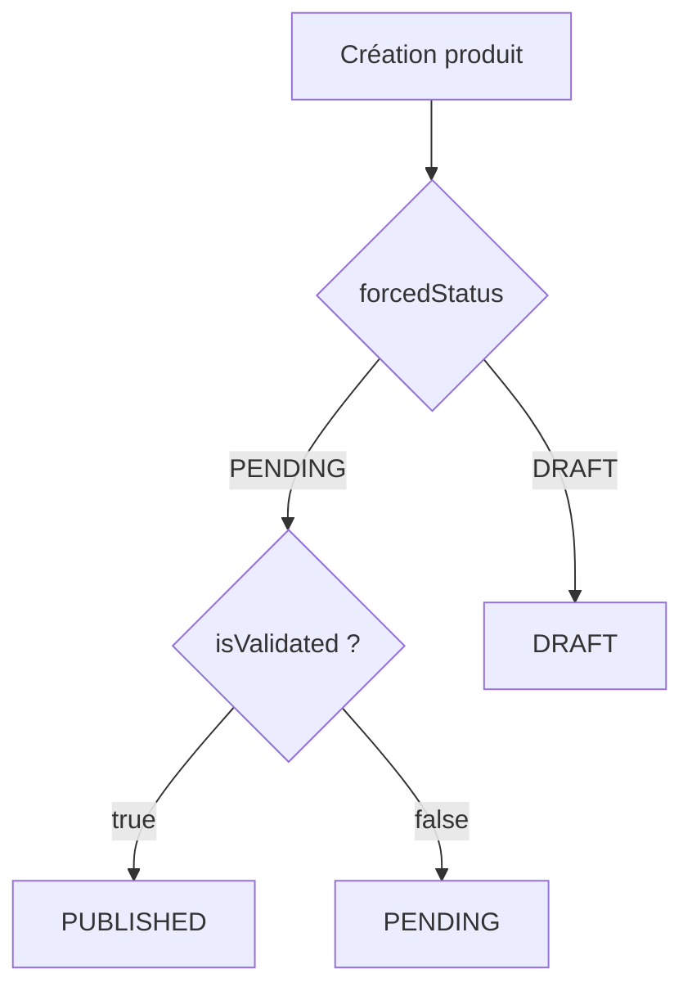

# ⛑️ Correctifs Backend – Gestion de `forcedStatus`

> Objet : faire en sorte qu'un produit créé par le vendeur apparaisse **directement** en `PUBLISHED` quand :
> 1. le champ `forcedStatus` vaut `PENDING`
> 2. **et** que le design lié est déjà validé (`isValidated=true` ou `designValidationStatus = VALIDATED`).

## 1. Contexte

Le frontend envoie désormais systématiquement :

```jsonc
{
  "forcedStatus": "PENDING",   // workflow AUTO-PUBLISH
  "isValidated": true           // quand le design est déjà approuvé
}
```

Malgré cela, le backend répond actuellement :

```
status = DRAFT
forcedStatus = PENDING
isValidated = false  // incohérent ! le design est VALIDATED côté DB
```

Cela bloque la mise en ligne immédiate ; le produit reste invisible côté client.

## 2. Logique attendue côté backend

| Design validé ? | forcedStatus | Statut à créer | Comportement attendu |
|-----------------|--------------|----------------|----------------------|
| true            | PENDING      | PUBLISHED      | Publication immédiate |
| false           | PENDING      | PENDING        | Création en attente; publication automatique lors de la validation du design |
| *               | DRAFT        | DRAFT          | Toujours un brouillon; le vendeur publiera manuellement après validation |

Diagramme simplifié :



## 3. Correctif proposé (NestJS / Prisma)

```ts
// services/vendorProduct.service.ts
if (isApproved /* design validé */) {
  // AUTO-PUBLISH
  await prisma.vendorProduct.updateMany({
    where: { designId, forcedStatus: 'PENDING' },
    data: { status: 'PUBLISHED', isValidated: true }
  });

  // MANUAL-PUBLISH
  await prisma.vendorProduct.updateMany({
    where: { designId, forcedStatus: 'DRAFT' },
    data: { isValidated: true } // on ne change pas status
  });
} else {
  // design encore en attente → rien à faire ici
}
```

• Veiller également à mettre `isValidated=true` quand on passe en `PUBLISHED`.
• La même logique doit être appliquée dans toute « cascade de validation » (cron ou hook Postgres).

## 4. Tests rapides

```bash
# 1. Cas design validé + forcedStatus=PENDING
echo '{"forcedStatus":"PENDING","isValidated":true}' | http POST /api/vendor/products  # doit répondre status=PUBLISHED

# 2. Cas design non validé + forcedStatus=PENDING
echo '{"forcedStatus":"PENDING","isValidated":false}' | http POST /api/vendor/products  # doit répondre status=PENDING

# 3. forcedStatus=DRAFT quel que soit le design
http POST /api/vendor/products < payload_draft.json  # status=DRAFT
```

## 5. Priorité & Impact

* Bloquant pour les vendeurs : empêche la mise en ligne immédiate.
* Correctif isolé : < 30 lignes de code, sans impact sur la base.
* Aucune migration requise.

Merci de corriger au plus vite 🙏 