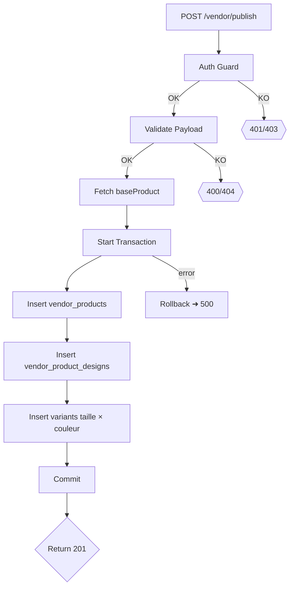

# Guide d'Intégration Backend – « Valider la Sélection »

> **Objectif :** Enregistrer en base de données les produits qu'un vendeur vient de configurer (design, prix, tailles, couleurs…) lorsqu'il clique sur **« Valider la sélection »** depuis la page `SellDesignPage` du front-end.
>
> Le front-end déclenche un appel HTTP `POST` vers `/vendor/publish` pour **chaque** produit sélectionné.
>
> Ce document décrit :
> 1. Le contrat d'API exact (payload ⇄ réponse)
> 2. Les règles métier & validations côté serveur
> 3. Les actions de persistance recommandées (schéma SQL/NoSQL)
> 4. Un *prompt* prêt-à-l'emploi pour générer/compléter le code backend via ChatGPT ou un autre LLM.

---

## 1. Endpoint

- **URL** : `POST /vendor/publish`
- **Auth** : Cookie de session ou JWT du vendeur (obligatoire)
- **Content-Type** : `application/json`
- **Rate-limit** : 10 req/s par vendeur (recommandé)

### 1.1. Payload JSON

```json
{
  "baseProductId": 42,
  "designUrl": "https://cdn.printalma.com/uploads/designs/2024/03/design-abc.png",
  "price": 9500,
  "sizes": [1, 2, 3],
  "colors": [10, 11]
}
```

| Champ | Type | Obligatoire | Description |
|-------|------|-------------|-------------|
| `baseProductId` | number | ✅ | Identifiant du **produit modèle** (ex: T-Shirt Premium) sur lequel le vendeur applique son design. |
| `designUrl` | string (URL) | ✅ | URL publique du fichier design uploadé par le vendeur. |
| `price` | number | ✅ | Prix de vente public souhaité **en FCFA**. Doit être > `baseProduct.price`. |
| `sizes` | number[] | ➖ | Identifiants des tailles activées par le vendeur. Vides ⇒ toutes tailles dispos. |
| `colors` | number[] | ➖ | Identifiants des couleurs activées. Vides ⇒ toutes couleurs dispos. |

### 1.2. Réponse 2xx – Succès

```json
{
  "status": "success",
  "productId": 131,
  "slug": "t-shirt-premium-coton-bio-design-abc"
}
```

### 1.3. Réponses d'erreur

| Code | Exemple corpo | Quand ? |
|------|---------------|---------|
| 400  | `{ "error": "PRICE_TOO_LOW" }` | `price` ≤ `baseProduct.price` |
| 403  | `{ "error": "UNAUTHORIZED" }` | Le token ne correspond pas au vendeur propriétaire |
| 404  | `{ "error": "BASE_PRODUCT_NOT_FOUND" }` | `baseProductId` inexistant |
| 409  | `{ "error": "PRODUCT_ALREADY_PUBLISHED" }` | Le même design est déjà publié sur ce produit |
| 500  | `{ "error": "INTERNAL_SERVER_ERROR" }` | Erreur non gérée |

---

## 2. Règles Métier & Validation

1. **Prix minimum** : `price` doit être strictement supérieur au prix de base (`baseProduct.price`).
2. **Design unique** : interdire la publication du **même** `designUrl` plusieurs fois sur le **même** `baseProductId` pour un même vendeur.
3. **Tailles & couleurs** : filtrer les IDs reçus pour ne garder que ceux réellement disponibles sur le `baseProduct`.
4. **Slug** : générer un slug SEO unique combinant nom produit + hash design.
5. **Transactions** : persister dans une transaction (design → produit → variantes) afin d'éviter les incohérences.

---

## 3. Persistance (Exemple SQL)

```
Table `vendor_products`
┌────────┬────────────────────┬─────────┬──────────────────┐
│ id PK  │ vendor_id FK       │ base_id │ price (INTEGER)  │
├────────┼────────────────────┼─────────┼──────────────────┤
│ …      │ …                  │ …       │ …                │
└────────┴────────────────────┴─────────┴──────────────────┘

Table `vendor_product_designs`
┌────────┬───────────────┬──────────────────────────────────────────────────┐
│ id PK  │ product_id FK │ design_url (TEXT)                               │
└────────┴───────────────┴──────────────────────────────────────────────────┘

Table `vendor_product_variants` (taille × couleur)
┌────────┬───────────────┬──────────────┬────────────┐
│ id PK  │ product_id FK │ size_id FK   │ color_id FK│
└────────┴───────────────┴──────────────┴────────────┘
```

> Le design est séparé pour permettre plusieurs designs sur un même base product.

---

## 4. Flux complet côté serveur



---

## 5. Prompt « LLM » prêt à copier-coller

```
SYSTEM: Tu es un développeur backend senior Node.js + TypeORM.
USER: Implémente l'endpoint suivant dans un projet Express existant :
  • Route: POST /vendor/publish (auth middleware déjà présent)
  • Payload JSON décrit ci-dessous.
  • Contraintes: validation Joi, transaction TypeORM, retourne 201 JSON.
  • Schéma simplifié (PostgreSQL): vendor_products, vendor_product_designs, vendor_product_variants.
  • Règles métier listées ci-après.
  • Génère le code complet : contrôleur, service, validations, tests unitaires Jest.
  • Ajoute les commentaires clés en français.
<insère ici le contenu des sections 1 & 2 ci-dessus>
```

---

## 6. Exemple de Test unitaire (Jest)

```ts
it('publie un produit avec succès', async () => {
  const payload = {
    baseProductId: 42,
    designUrl: 'https://cdn.printalma.com/uploads/d/abc.png',
    price: 9500,
    sizes: [1, 2],
    colors: [10]
  };
  const res = await request(app)
    .post('/vendor/publish')
    .set('Cookie', mockCookie)
    .send(payload);
  expect(res.status).toBe(201);
  expect(res.body).toHaveProperty('productId');
});
```

---

## 7. Points d'Attention

- **Sécurité URL** : valider que `designUrl` pointe sur votre CDN/S3.
- **Idempotence** : si le même payload est renvoyé → retourner 200 avec le même `productId`.
- **Performance** : batcher les insertions variante si >50.
- **Notifications** : envisager un WebSocket/Queue pour prévenir le vendeur de la mise en ligne.

---

**🔥 Voilà ! Copiez le prompt (section 5) et collez-le dans ChatGPT pour générer l'implémentation backend détaillée.** 