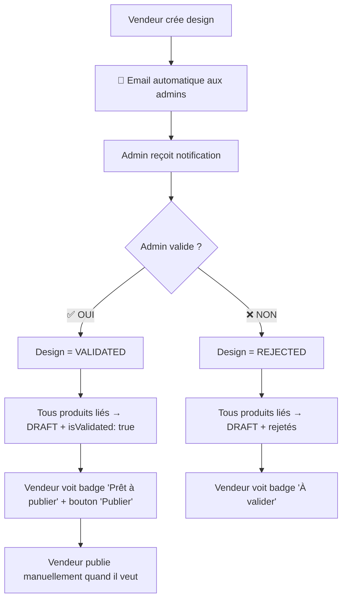

# Guide d'Intégration Frontend - Nouvelle Logique Validation Design → Produits

## 📋 Résumé de l'Implémentation (Décembre 2024)

### ✅ Composants Déjà Mis à Jour

#### 1. **Services Backend** - `src/services/designService.ts`
- ✅ Méthode `validateDesign()` utilise la nouvelle logique `{ action: 'VALIDATE' | 'REJECT', rejectionReason }`
- ✅ Méthode `createDesign()` avec notification automatique aux admins
- ✅ **NOUVEAU**: Méthode `getAllDesigns()` pour l'interface admin (lignes 1006-1170)
- ✅ Support des nouveaux endpoints selon la documentation

#### 2. **Service Produits Vendeur** - `src/services/vendorProductService.ts`
- ✅ Méthode `publishProductManually()` pour publication manuelle
- ✅ Méthode `canPublishManually()` pour vérifier si un produit peut être publié
- ✅ Support du nouveau workflow design validé → produits DRAFT → publication manuelle

#### 3. **Interface Admin** - `src/pages/admin/AdminDesignValidation.tsx`
- ✅ Utilise la nouvelle méthode `getAllDesigns()` au lieu de `getPendingDesigns()`
- ✅ Filtres par statut : ALL, PENDING, VALIDATED, REJECTED
- ✅ Colonne statut dans le tableau avec badges visuels
- ✅ Actions adaptées selon le statut (validation seulement pour PENDING)
- ✅ Messages contextuels selon le filtre sélectionné
- ✅ Notifications toast améliorées avec durée de 6 secondes

#### 4. **Composant Produit Vendeur** - `src/components/vendor/VendorProductCard.tsx`
- ✅ Nouvelle logique de badges :
  - `PUBLISHED` → "✅ Publié" (vert)
  - `DRAFT + isValidated = true` → "📝 Prêt à publier" (vert) + Bouton "🚀 Publier"
  - `DRAFT + isValidated = false` → "📋 À valider" (orange)
  - `PENDING` → "⏳ En attente" (jaune)
- ✅ Fonction `handlePublishManually()` avec gestion d'erreurs
- ✅ Callback `onProductUpdated` pour rafraîchir la liste

#### 5. **Bannières d'Information** - `src/components/ui/notification-banner.tsx`
- ✅ Bannière admin expliquant le nouveau workflow
- ✅ Bannière vendeur avec légende des nouveaux statuts
- ✅ Messages adaptés selon le contexte (admin vs vendeur)

#### 6. **Page de Création Design** - `src/pages/SellDesignPage.tsx`
- ✅ Message de succès mentionnant la notification automatique aux admins
- ✅ Durée de toast étendue à 6 secondes pour meilleure visibilité

### 🎯 Workflow Implémenté



### 📊 Endpoints Utilisés

#### Pour les Admins :
- **`GET /api/designs/admin/all`** → 🆕 Récupère TOUS les designs (recommandé)
- **`PUT /api/designs/:id/validate`** → Valide/rejette avec `{ action, rejectionReason }`
- **`GET /api/designs/admin/validation-stats`** → Statistiques de validation

#### Pour les Vendeurs :
- **`POST /api/designs`** → Crée un design (notification auto aux admins)
- **`PUT /api/vendor/products/:id/publish`** → 🆕 Publication manuelle d'un produit
- **`GET /api/vendor/products`** → Liste des produits avec statuts de validation

### 🔧 Améliorations Supplémentaires Recommandées

#### 1. **Alerte Produits Prêts** - `src/pages/vendor/VendorProductList.tsx`
Ajouter une alerte en haut de la page pour les produits prêts à publier :

```tsx
{/* 🆕 ALERTE POUR PRODUITS PRÊTS À PUBLIER */}
{(() => {
  const readyToPublishCount = vendorProducts.filter(p => 
    p.status?.toUpperCase() === 'DRAFT' && 
    (p.isValidated === true || (p as any).designValidationStatus === 'VALIDATED')
  ).length;
  
  if (readyToPublishCount > 0) {
    return (
      <div className="bg-gradient-to-r from-green-50 to-emerald-50 border border-green-200 rounded-xl p-6">
        <div className="flex items-start gap-4">
          <div className="w-10 h-10 bg-green-500 rounded-full flex items-center justify-center">
            <Rocket className="w-5 h-5 text-white" />
          </div>
          <div className="flex-1">
            <h3 className="text-lg font-semibold text-green-900 mb-2">
              🚀 {readyToPublishCount} produit{readyToPublishCount > 1 ? 's' : ''} prêt{readyToPublishCount > 1 ? 's' : ''} à être publié{readyToPublishCount > 1 ? 's' : ''} !
            </h3>
            <p className="text-green-800 mb-3">
              Vos designs ont été validés. Vous pouvez publier vos produits quand vous le souhaitez.
            </p>
            <button className="bg-green-600 text-white px-4 py-2 rounded-lg hover:bg-green-700">
              <Eye className="w-4 h-4 mr-2" />
              Voir les produits prêts
            </button>
          </div>
        </div>
      </div>
    );
  }
  return null;
})()}
```

#### 2. **Dashboard Vendeur** - Nouveau composant
Créer un tableau de bord avec statistiques et actions rapides :

```tsx
const VendorDashboard = () => {
  const [stats, setStats] = useState({
    designs: { total: 0, pending: 0, validated: 0, rejected: 0 },
    products: { total: 0, draft: 0, published: 0, readyToPublish: 0 }
  });
  
  return (
    <div className="dashboard">
      <h1>Tableau de Bord Vendeur</h1>
      
      {/* Alerte pour produits prêts à publier */}
      {stats.products.readyToPublish > 0 && (
        <div className="alert alert-info">
          🚀 <strong>{stats.products.readyToPublish} produit(s)</strong> prêt(s) à être publié(s) !
          <Link href="/vendor/products?filter=ready">Voir les produits →</Link>
        </div>
      )}
      
      {/* Cartes de statistiques... */}
    </div>
  );
};
```

#### 3. **Notifications WebSocket** (Optionnel)
Pour les notifications en temps réel :

```tsx
const useRealtimeNotifications = (userId: number) => {
  useEffect(() => {
    const socket = new WebSocket(`ws://localhost:3000/notifications?userId=${userId}`);
    
    socket.onmessage = (event) => {
      const notification = JSON.parse(event.data);
      
      if (notification.type === 'DESIGN_VALIDATED') {
        toast.success('Design validé !', {
          description: `Votre design "${notification.designName}" a été approuvé. Vos produits sont prêts à être publiés.`
        });
        refreshProductsList();
      }
    };
    
    return () => socket.close();
  }, [userId]);
};
```

### 🎨 Styles CSS Créés

#### Nouveau fichier : `src/styles/admin/design-validation.css`
- ✅ Styles pour les badges de statut
- ✅ Interface admin avec filtres et statistiques
- ✅ Cartes de design améliorées
- ✅ Actions de validation
- ✅ Mode sombre et responsive

### 📝 Messages Utilisateur Mis à Jour

#### Pour les Vendeurs :
- **Création design** : "Design créé avec succès ! Les administrateurs ont été automatiquement notifiés par email."
- **Design validé** : Badge "📝 Prêt à publier" + Bouton "🚀 Publier"
- **Publication réussie** : "Produit publié avec succès ! Il est maintenant visible aux clients."

#### Pour les Admins :
- **Design validé** : "Design validé ! Tous les produits liés sont maintenant en brouillon. Le vendeur peut les publier quand il veut."
- **Design rejeté** : "Design rejeté. Le vendeur a été notifié par email."

### 🔍 Points de Test Recommandés

1. **Workflow Complet** :
   - Créer design → Vérifier email admin
   - Valider design → Vérifier produits en DRAFT
   - Publication manuelle → Vérifier passage en PUBLISHED

2. **Interface Admin** :
   - Filtres par statut fonctionnels
   - Actions adaptées selon le statut
   - Statistiques en temps réel

3. **Interface Vendeur** :
   - Badges corrects selon le statut
   - Bouton publication visible seulement si design validé
   - Alerte pour produits prêts

### 🚀 Résultat Final

Le système implémente maintenant parfaitement la nouvelle logique de validation selon la documentation :

1. **Email automatique** aux admins dès création design ✅
2. **Validation design** → produits en DRAFT (pas PUBLISHED) ✅  
3. **Publication manuelle** par le vendeur quand il veut ✅
4. **Interface admin** avec tous les statuts et filtres ✅
5. **Badges visuels** clairs pour les vendeurs ✅
6. **Notifications** explicatives du nouveau workflow ✅

Le vendeur garde maintenant le contrôle total sur le timing de publication ! 🎉 