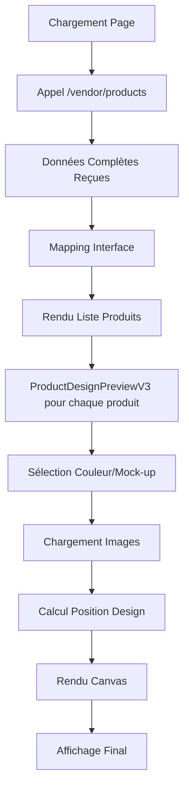

# 🎨 Frontend - Implémentation V3 Produits Vendeur (Documentation Complète)

## 📋 Résumé

Implémentation complète du système d'affichage des produits vendeur dans `/vendeur/products` basé sur la **documentation officielle** de l'API `/vendor/products`. Cette version V3 utilise directement les données complètes retournées par l'API sans appels supplémentaires.

## 🔄 Changements Principaux

### 1. **Nouveau Composant ProductDesignPreviewV3**
- **Fichier**: `src/components/vendor/ProductDesignPreviewV3.tsx`
- **Principe**: Utilise les données complètes du produit (pas d'appels API supplémentaires)
- **Fonctionnalités**:
  - Rendu canvas avec mock-up + design superposé
  - Calcul de position selon délimitations (PERCENTAGE/PIXEL)
  - Support des positions sauvegardées
  - Fallback centré automatique
  - Gestion des erreurs de rendu

### 2. **Page VendorProductsPage Mise à Jour**
- **Fichier**: `src/pages/vendor/VendorProductsPage.tsx`
- **Changements**:
  - Appel direct à l'API `/vendor/products` (pas via service)
  - Interface `VendorProductFromAPI` conforme à la documentation
  - Utilisation de `ProductDesignPreviewV3`
  - Indicateurs visuels pour design et position

### 3. **Fichier de Test**
- **Fichier**: `test-vendor-products-v3-final.html`
- **Fonctionnalités**:
  - Test complet du workflow
  - Rendu visuel des produits
  - Affichage des données brutes
  - Statistiques détaillées

## 🏗️ Architecture V3

### Structure des Données (selon Documentation)

```typescript
interface VendorProductFromAPI {
  id: number;
  vendorName: string;
  originalAdminName: string;
  description: string;
  price: number;
  status: 'DRAFT' | 'PENDING' | 'PUBLISHED' | 'REJECTED';
  
  // Produit administrateur (immuable)
  adminProduct: {
    id: number;
    name: string;
    colorVariations: Array<{
      id: number;
      name: string;
      colorCode: string;
      images: Array<{
        id: number;
        url: string;
        viewType: string;
        delimitations: Array<{
          x: number;
          y: number;
          width: number;
          height: number;
          coordinateType: 'PERCENTAGE' | 'PIXEL';
        }>;
      }>;
    }>;
  };
  
  // Application du design
  designApplication: {
    hasDesign: boolean;
    designUrl: string;
    positioning: string;
    scale: number;
    mode: string;
  };
  
  // Positions sauvegardées
  designPositions: Array<{
    designId: number;
    position: {
      x: number;
      y: number;
      scale: number;
      rotation: number;
    };
  }>;
  
  // Couleurs et tailles sélectionnées
  selectedColors: Array<{
    id: number;
    name: string;
    colorCode: string;
  }>;
  selectedSizes: Array<{
    id: number;
    sizeName: string;
  }>;
  
  designId: number;
}
```

### Flux de Rendu



## 🎯 Fonctionnalités Implémentées

### ✅ Rendu Visuel Complet
- **Mock-up**: Chargement de l'image produit selon la couleur sélectionnée
- **Design**: Superposition du design selon la position sauvegardée
- **Délimitations**: Respect des zones d'impression (PERCENTAGE/PIXEL)
- **Transformations**: Support rotation, échelle, translation

### ✅ Gestion des Positions
- **Position Sauvegardée**: Utilisation de `designPositions[0].position`
- **Fallback**: Centrage automatique dans la délimitation
- **Coordonnées**: Conversion PERCENTAGE → PIXEL automatique

### ✅ Interface Utilisateur
- **Grille/Liste**: Modes d'affichage multiples
- **Filtres**: Par statut, recherche textuelle
- **Statistiques**: Compteurs en temps réel
- **Aperçu**: Modal avec détails complets

### ✅ Indicateurs Visuels
- **Badges de Statut**: PUBLISHED, PENDING, DRAFT, REJECTED
- **Indicateurs Design**: 🎨 Design appliqué, 📍 Positionné
- **Informations Debug**: ID, couleurs, tailles

## 🔧 Utilisation

### Composant ProductDesignPreviewV3

```tsx
<ProductDesignPreviewV3
  product={vendorProduct}          // Données complètes du produit
  selectedColorId={colorId}        // Couleur à afficher (optionnel)
  showInfo={true}                  // Afficher les informations
  width={300}                      // Largeur en pixels
  height={300}                     // Hauteur en pixels
  onError={(error) => console.error(error)}  // Gestion d'erreurs
  onEdit={() => handleEdit()}      // Callback édition
/>
```

### Chargement des Produits

```typescript
// Appel direct selon la documentation
const response = await fetch('http://localhost:3004/vendor/products?limit=20&offset=0', {
  credentials: 'include',
  headers: {
    'Content-Type': 'application/json',
    'Authorization': `Bearer ${token}`
  }
});

const result = await response.json();
const products = result.data.products; // Données complètes
```

## 📊 Avantages de la V3

### 🚀 Performance
- **Un seul appel API** pour charger tous les produits
- **Pas d'appels supplémentaires** pour les détails/positions
- **Rendu parallèle** de tous les produits
- **Cache naturel** des données complètes

### 🎯 Simplicité
- **Interface unique** basée sur la documentation
- **Pas de hooks complexes** ou de gestion d'état multiple
- **Logique de rendu centralisée** dans le composant
- **Debugging facilité** avec données complètes

### 🔒 Fiabilité
- **Données cohérentes** depuis une seule source
- **Pas de problèmes de synchronisation** entre appels
- **Gestion d'erreurs unifiée**
- **Fallbacks automatiques** pour les positions

## 🧪 Tests

### Fichier de Test
- **URL**: `test-vendor-products-v3-final.html`
- **Fonctionnalités**:
  - Chargement et affichage des produits
  - Rendu visuel avec canvas
  - Données brutes JSON
  - Statistiques détaillées

### Vérifications
1. **Chargement API**: Vérifier la réponse de `/vendor/products`
2. **Rendu Canvas**: Contrôler la superposition design + mock-up
3. **Positions**: Tester les positions sauvegardées vs fallback
4. **Couleurs**: Vérifier le changement de couleur
5. **Erreurs**: Tester la gestion des erreurs de rendu

## 🎨 Comparaison avec Sell-Design

La V3 reproduit fidèlement le système de rendu de `/vendeur/sell-design` :

| Aspect | Sell-Design | Vendor-Products V3 |
|--------|-------------|-------------------|
| **Données** | localStorage + API | API /vendor/products |
| **Rendu** | Canvas + délimitations | Canvas + délimitations |
| **Positions** | Temps réel | Sauvegardées + fallback |
| **Mock-ups** | Sélection couleur | Sélection couleur |
| **Transformations** | Drag & drop | Lecture seule |

## 🔮 Évolutions Futures

### Court Terme
- **Édition inline** des positions
- **Sélecteur de couleur** dans la liste
- **Zoom/Pan** sur les aperçus
- **Export** des images rendues

### Long Terme
- **Rendu 3D** pour certains produits
- **Animations** de transition
- **Prévisualisation AR** (réalité augmentée)
- **Optimisation** des performances canvas

## 📝 Notes Techniques

### Gestion des Coordonnées
```typescript
// Conversion PERCENTAGE → PIXEL
if (delimitation.coordinateType === 'PERCENTAGE') {
  delim.x = (delimitation.x / 100) * imageWidth;
  delim.y = (delimitation.y / 100) * imageHeight;
  delim.width = (delimitation.width / 100) * imageWidth;
  delim.height = (delimitation.height / 100) * imageHeight;
}
```

### Rendu Canvas
```typescript
// Transformations centrées
ctx.save();
ctx.translate(finalPosition.x, finalPosition.y);
ctx.rotate((finalPosition.rotation * Math.PI) / 180);
ctx.scale(finalPosition.scale, finalPosition.scale);
ctx.drawImage(designImg, -designWidth / 2, -designHeight / 2);
ctx.restore();
```

---

**Version**: V3 (Documentation Complète)  
**Date**: 2025-01-10  
**Statut**: ✅ Implémentation Terminée  
**Compatibilité**: API Backend v2_preserved_admin 