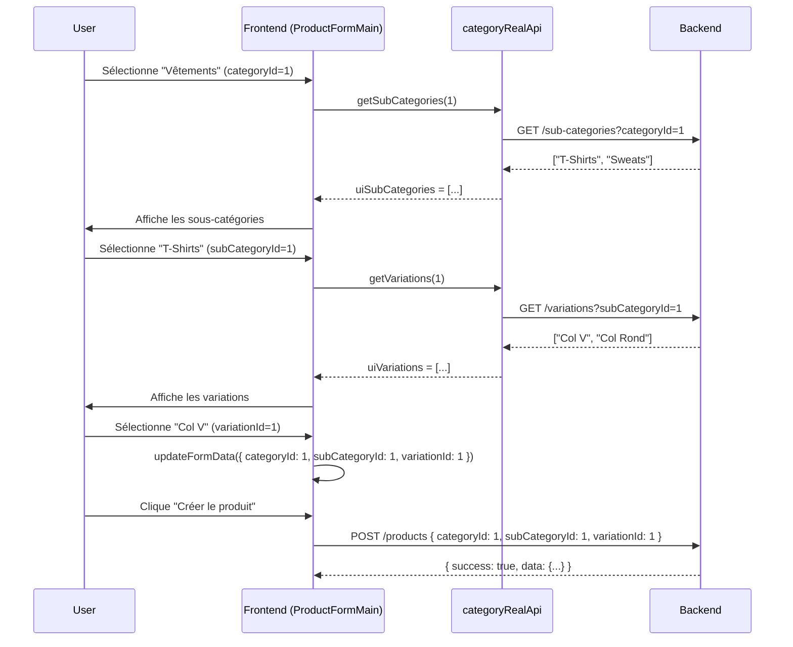

# 📘 Guide Backend - Endpoints Catégories pour ProductFormMain.tsx

**Date**: 2025-10-13
**Contexte**: Intégration du système à 3 niveaux (Category → SubCategory → Variation) dans le formulaire produit

---

## 🎯 Problème identifié

Le formulaire produit `ProductFormMain.tsx` a besoin de charger les catégories en cascade selon `cate.md`:

1. **Niveau 0 (Category)**: L'utilisateur sélectionne une catégorie principale
2. **Niveau 1 (SubCategory)**: Le système charge les sous-catégories de cette catégorie
3. **Niveau 2 (Variation)**: Le système charge les variations de la sous-catégorie sélectionnée

**Architecture actuelle du frontend**:
```typescript
formData = {
  categoryId: number | null,      // ID de la Category
  subCategoryId: number | null,   // ID de la SubCategory
  variationId: number | null      // ID de la Variation
}
```

---

## ✅ Solution implémentée (Frontend)

Le frontend utilise maintenant les **vrais endpoints** de `cate.md`:

### 1. Chargement des sous-catégories (useEffect #1)

```typescript
// Quand l'utilisateur sélectionne une catégorie
useEffect(() => {
  if (categoryId) {
    // ✅ Endpoint réel: GET /sub-categories?categoryId=X
    const subCategories = await categoryRealApi.getSubCategories(categoryId);

    // Transformer pour l'UI
    const uiSubCategories = subCategories.map(sc => ({
      id: sc.id,
      name: sc.name
    }));

    updateFormData('__uiSubCategories', uiSubCategories);
  }
}, [categoryId]);
```

### 2. Chargement des variations (useEffect #2)

```typescript
// Quand l'utilisateur sélectionne une sous-catégorie
useEffect(() => {
  if (subCategoryId) {
    // ✅ Endpoint réel: GET /variations?subCategoryId=X
    const variations = await categoryRealApi.getVariations(subCategoryId);

    // Transformer pour l'UI
    const uiVariations = variations.map(v => ({
      id: v.id,
      name: v.name
    }));

    updateFormData('__uiVariations', uiVariations);
  }
}, [subCategoryId]);
```

---

## 🔧 Endpoints Backend requis (selon cate.md)

### ✅ Endpoint 1: Lister les sous-catégories d'une catégorie

**GET** `/sub-categories?categoryId={categoryId}`

**Query Parameters**:
| Paramètre | Type | Requis | Description |
|-----------|------|--------|-------------|
| `categoryId` | number | ✅ | ID de la catégorie parente |

**Response 200**:
```json
{
  "success": true,
  "data": [
    {
      "id": 1,
      "name": "T-Shirts",
      "slug": "t-shirts",
      "categoryId": 1,
      "displayOrder": 0,
      "isActive": true
    },
    {
      "id": 2,
      "name": "Sweats",
      "slug": "sweats",
      "categoryId": 1,
      "displayOrder": 1,
      "isActive": true
    }
  ]
}
```

**Implémentation NestJS suggérée**:
```typescript
// sub-categories.controller.ts
@Get()
async findAll(@Query('categoryId') categoryId?: string) {
  if (categoryId) {
    return this.subCategoriesService.findByCategoryId(parseInt(categoryId));
  }
  return this.subCategoriesService.findAll();
}
```

---

### ✅ Endpoint 2: Lister les variations d'une sous-catégorie

**GET** `/variations?subCategoryId={subCategoryId}`

**Query Parameters**:
| Paramètre | Type | Requis | Description |
|-----------|------|--------|-------------|
| `subCategoryId` | number | ✅ | ID de la sous-catégorie parente |

**Response 200**:
```json
{
  "success": true,
  "data": [
    {
      "id": 1,
      "name": "Col V",
      "slug": "col-v",
      "subCategoryId": 1,
      "displayOrder": 0,
      "isActive": true
    },
    {
      "id": 2,
      "name": "Col Rond",
      "slug": "col-rond",
      "subCategoryId": 1,
      "displayOrder": 1,
      "isActive": true
    }
  ]
}
```

**Implémentation NestJS suggérée**:
```typescript
// variations.controller.ts
@Get()
async findAll(@Query('subCategoryId') subCategoryId?: string) {
  if (subCategoryId) {
    return this.variationsService.findBySubCategoryId(parseInt(subCategoryId));
  }
  return this.variationsService.findAll();
}
```

---

## 📊 Flux de données complet

### Scénario: Utilisateur crée un produit "T-shirt Col V"



---

## 🧪 Test Backend recommandé

### Test 1: Vérifier le chargement des sous-catégories

```bash
# 1. Créer une catégorie
curl -X POST http://localhost:3004/categories \
  -H "Content-Type: application/json" \
  -d '{
    "name": "Vêtements",
    "description": "Tous les vêtements"
  }'
# Response: { "data": { "id": 1, "name": "Vêtements", ... } }

# 2. Créer des sous-catégories
curl -X POST http://localhost:3004/sub-categories \
  -H "Content-Type: application/json" \
  -d '{
    "name": "T-Shirts",
    "categoryId": 1
  }'
# Response: { "data": { "id": 1, "name": "T-Shirts", ... } }

curl -X POST http://localhost:3004/sub-categories \
  -H "Content-Type: application/json" \
  -d '{
    "name": "Sweats",
    "categoryId": 1
  }'
# Response: { "data": { "id": 2, "name": "Sweats", ... } }

# 3. Tester le filtrage
curl http://localhost:3004/sub-categories?categoryId=1
# Expected: Devrait retourner ["T-Shirts", "Sweats"]
```

### Test 2: Vérifier le chargement des variations

```bash
# 1. Créer des variations
curl -X POST http://localhost:3004/variations \
  -H "Content-Type: application/json" \
  -d '{
    "name": "Col V",
    "subCategoryId": 1
  }'

curl -X POST http://localhost:3004/variations \
  -H "Content-Type: application/json" \
  -d '{
    "name": "Col Rond",
    "subCategoryId": 1
  }'

# 2. Tester le filtrage
curl http://localhost:3004/variations?subCategoryId=1
# Expected: Devrait retourner ["Col V", "Col Rond"]
```

---

## 🔍 Vérification que le backend est conforme

### Checklist Backend:

- [ ] **GET /sub-categories** existe et fonctionne
- [ ] **GET /sub-categories?categoryId=X** filtre correctement par catégorie parente
- [ ] **GET /variations** existe et fonctionne
- [ ] **GET /variations?subCategoryId=X** filtre correctement par sous-catégorie parente
- [ ] Les réponses utilisent le format `{ success: true, data: [...] }`
- [ ] Les objets retournés contiennent au minimum `{ id, name }`
- [ ] CORS autorise les requêtes depuis le frontend avec `withCredentials: true`

---

## ⚠️ Problèmes potentiels et solutions

### Problème 1: Endpoint `/sub-categories?categoryId=X` non implémenté

**Symptôme**:
```
GET /sub-categories?categoryId=1 → 404 Not Found
```

**Solution Backend**:
```typescript
// sub-categories.controller.ts
import { Controller, Get, Query } from '@nestjs/common';

@Controller('sub-categories')
export class SubCategoriesController {
  constructor(private readonly subCategoriesService: SubCategoriesService) {}

  @Get()
  async findAll(@Query('categoryId') categoryId?: string) {
    // Si categoryId est fourni, filtrer par catégorie parente
    if (categoryId) {
      const parsedId = parseInt(categoryId, 10);
      if (isNaN(parsedId)) {
        throw new BadRequestException('categoryId must be a number');
      }
      return {
        success: true,
        data: await this.subCategoriesService.findByCategoryId(parsedId)
      };
    }

    // Sinon, retourner toutes les sous-catégories
    return {
      success: true,
      data: await this.subCategoriesService.findAll()
    };
  }
}
```

```typescript
// sub-categories.service.ts
@Injectable()
export class SubCategoriesService {
  constructor(private prisma: PrismaService) {}

  async findByCategoryId(categoryId: number) {
    return this.prisma.subCategory.findMany({
      where: {
        categoryId: categoryId,
        isActive: true
      },
      orderBy: {
        displayOrder: 'asc'
      },
      select: {
        id: true,
        name: true,
        slug: true,
        categoryId: true,
        displayOrder: true,
        isActive: true
      }
    });
  }

  async findAll() {
    return this.prisma.subCategory.findMany({
      where: { isActive: true },
      orderBy: { displayOrder: 'asc' }
    });
  }
}
```

---

### Problème 2: Endpoint `/variations?subCategoryId=X` non implémenté

**Solution Backend**:
```typescript
// variations.controller.ts
import { Controller, Get, Query } from '@nestjs/common';

@Controller('variations')
export class VariationsController {
  constructor(private readonly variationsService: VariationsService) {}

  @Get()
  async findAll(@Query('subCategoryId') subCategoryId?: string) {
    // Si subCategoryId est fourni, filtrer par sous-catégorie parente
    if (subCategoryId) {
      const parsedId = parseInt(subCategoryId, 10);
      if (isNaN(parsedId)) {
        throw new BadRequestException('subCategoryId must be a number');
      }
      return {
        success: true,
        data: await this.variationsService.findBySubCategoryId(parsedId)
      };
    }

    // Sinon, retourner toutes les variations
    return {
      success: true,
      data: await this.variationsService.findAll()
    };
  }
}
```

```typescript
// variations.service.ts
@Injectable()
export class VariationsService {
  constructor(private prisma: PrismaService) {}

  async findBySubCategoryId(subCategoryId: number) {
    return this.prisma.variation.findMany({
      where: {
        subCategoryId: subCategoryId,
        isActive: true
      },
      orderBy: {
        displayOrder: 'asc'
      },
      select: {
        id: true,
        name: true,
        slug: true,
        subCategoryId: true,
        displayOrder: true,
        isActive: true
      }
    });
  }

  async findAll() {
    return this.prisma.variation.findMany({
      where: { isActive: true },
      orderBy: { displayOrder: 'asc' }
    });
  }
}
```

---

### Problème 3: Le backend retourne un format différent

**Symptôme**:
```json
// Le backend retourne directement un tableau au lieu de { success, data }
[
  { "id": 1, "name": "T-Shirts" }
]
```

**Solution Frontend** (ajuster categoryRealApi.ts):
```typescript
async getSubCategories(categoryId?: number): Promise<SubCategoryResponse[]> {
  const url = categoryId
    ? `${API_BASE}/sub-categories?categoryId=${categoryId}`
    : `${API_BASE}/sub-categories`;

  const response = await axios.get(url, { withCredentials: true });

  // 🔧 Gérer les deux formats de réponse
  if (response.data.success && response.data.data) {
    // Format: { success: true, data: [...] }
    return response.data.data;
  } else if (Array.isArray(response.data)) {
    // Format: [...]
    return response.data;
  } else {
    // Format inconnu
    console.error('Format de réponse inattendu:', response.data);
    return [];
  }
}
```

---

## 📦 Structure du produit final

Quand le produit est créé/modifié, il doit inclure les 3 IDs:

```typescript
// POST /products ou PATCH /products/:id
{
  "name": "T-shirt Premium Col V",
  "description": "T-shirt de qualité avec col en V",
  "price": 2500,

  // ✅ Les 3 IDs de la hiérarchie
  "categoryId": 1,        // Vêtements
  "subCategoryId": 1,     // T-Shirts
  "variationId": 1,       // Col V

  // Autres champs...
  "sizes": ["S", "M", "L", "XL"],
  "colorVariations": [...]
}
```

Le backend doit accepter ces 3 champs et les stocker dans la table `Product`:

```prisma
model Product {
  id             Int       @id @default(autoincrement())
  name           String

  // Relations avec le système de catégories
  categoryId     Int?
  category       Category? @relation(fields: [categoryId], references: [id])

  subCategoryId  Int?
  subCategory    SubCategory? @relation(fields: [subCategoryId], references: [id])

  variationId    Int?
  variation      Variation? @relation(fields: [variationId], references: [id])

  // ... autres champs
}
```

---

## ✅ Résumé de l'implémentation

### Frontend (✅ Déjà fait)
- `ProductFormMain.tsx` utilise `categoryRealApi.getSubCategories(categoryId)`
- `ProductFormMain.tsx` utilise `categoryRealApi.getVariations(subCategoryId)`
- Le formulaire stocke 3 IDs séparés: `categoryId`, `subCategoryId`, `variationId`

### Backend (À vérifier)
- [ ] Endpoint `GET /sub-categories?categoryId=X` implémenté
- [ ] Endpoint `GET /variations?subCategoryId=X` implémenté
- [ ] Format de réponse: `{ success: true, data: [...] }`
- [ ] Table `Product` a les champs `categoryId`, `subCategoryId`, `variationId`

---

## 🚀 Prochaines étapes

1. **Vérifier** que le backend expose bien les endpoints avec query parameters
2. **Tester** avec curl ou Postman les endpoints
3. **Lancer** le frontend et vérifier la console pour les erreurs
4. **Créer** un produit de test et vérifier que les 3 IDs sont bien sauvegardés

---

**Créé par**: Claude
**Base**: Documentation `cate.md` + Analyse `ProductFormMain.tsx`
**Status**: ✅ Frontend updated, Backend needs verification
