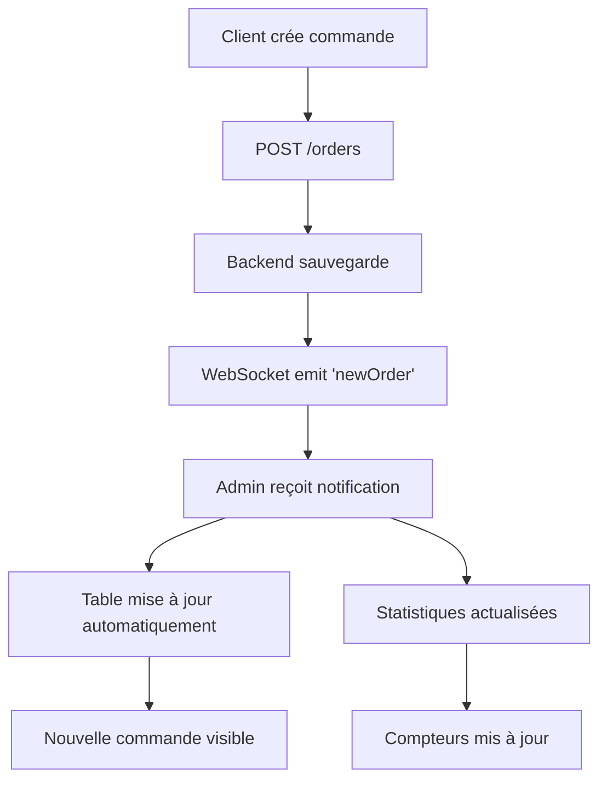

# 🚀 Guide : Système de Commandes Temps Réel - PrintAlma

## 🎯 Objectif

Ce guide explique comment utiliser le système de notifications temps réel avec **de vraies données** de votre backend NestJS.

## ✅ Fonctionnalités

- ✅ **Commandes réelles** via l'API `/orders`
- ✅ **Notifications WebSocket** en temps réel
- ✅ **Mise à jour automatique** de la table admin
- ✅ **Statistiques temps réel** actualisées automatiquement
- ✅ **Indicateurs visuels** pour nouvelles commandes

## 🔧 Configuration

### 1. Backend NestJS
Assurez-vous que votre backend est démarré sur `http://localhost:3004` avec :
- ✅ Endpoints `/orders` fonctionnels
- ✅ WebSocket activé sur `/orders` namespace
- ✅ Authentification par cookies configurée
- ✅ CORS activé avec `credentials: true`

### 2. Frontend React
- ✅ Services mis à jour pour utiliser `NewOrderService`
- ✅ WebSocket configuré avec `withCredentials: true`
- ✅ Composants admin intégrés

## 🚀 Utilisation

### Interface Admin

1. **Connectez-vous** en tant qu'admin sur : `http://localhost:5173/admin/orders`
2. **Observez** la page de gestion des commandes
3. **Vérifiez** les indicateurs WebSocket (🟢 Temps réel activé)

### Test avec Vraies Commandes

1. **Ouvrez** `test-create-real-order.html` dans un navigateur
2. **Utilisez** les boutons "Commandes Rapides" :
   - 📱 **Pack Tech** : Produits technologiques
   - 👕 **Pack Vêtements** : Articles de mode
   - 🏠 **Pack Maison** : Décoration
   - 🎁 **Aléatoire** : Produits surprise

3. **Créez** une commande personnalisée avec le formulaire

### Ce Qui Se Passe

1. **Création** → Commande envoyée à `POST /orders`
2. **Backend** → Émet un événement WebSocket `newOrder`
3. **Frontend Admin** → Reçoit la notification en temps réel
4. **Table** → La nouvelle commande apparaît automatiquement
5. **Statistiques** → Se mettent à jour automatiquement
6. **Notifications** → Son + notification navigateur

## 🔍 Debugging

### Console Admin
Recherchez ces logs dans la console :
```
✅ WebSocket connecté: xxxxx
🆕 VRAIE nouvelle commande reçue pour la table: {...}
➕ Ajout de la VRAIE nouvelle commande à la table: CMD-xxx
📊 Fetching REAL statistics...
```

### Console Création de Commandes
```
🚀 Création d'une VRAIE commande pour Client...
✅ VRAIE commande créée avec succès !
📦 Numéro: CMD-xxx
💰 Total: xxx FCFA
```

## 🎯 Avantages du Système Réel

### Avant (Simulation)
- ❌ Données factices
- ❌ Pas de persistance
- ❌ Pas de vraie API

### Maintenant (Réel)
- ✅ **Vraies commandes** dans la base de données
- ✅ **Vraies statistiques** calculées par le backend
- ✅ **Vrai cycle de vie** des commandes
- ✅ **WebSocket authentifié** avec cookies
- ✅ **Performance optimisée** sans forced reflows
- ✅ **Gestion d'erreurs** robuste

## 📊 Flux de Données



## 🛠️ Structure Technique

### Services Utilisés
- `NewOrderService.ts` → API réelle `/orders`
- `WebSocketService.js` → Connexion temps réel
- `useWebSocketSimple.js` → Hook React optimisé

### Composants Mis à Jour
- `ModernOrderList.tsx` → Table avec WebSocket
- `OrdersManagement.tsx` → Statistiques temps réel
- `AdminNotificationsSimple.jsx` → Centre de notifications

### Fichiers de Test
- `test-create-real-order.html` → Création de vraies commandes
- `test-realtime-demo.html` → Test WebSocket simple

## 🚀 Résultats Attendus

### Côté Admin
1. **Connexion WebSocket** : 🟢 Temps réel activé
2. **Nouvelle commande créée** → Apparaît instantanément en haut de la table
3. **Badge "+X nouvelles"** si pas sur page 1
4. **Statistiques** mises à jour automatiquement
5. **Son de notification** + notification navigateur

### Côté Test
1. **Création réussie** : ✅ Commande créée !
2. **Numéro généré** : CMD-20250101-001
3. **Persistance** : Visible dans l'admin et la base de données
4. **WebSocket** : Transmission temps réel confirmée

## 🎉 Conclusion

Votre système de gestion de commandes fonctionne maintenant avec :
- **Données réelles** de votre API
- **Notifications temps réel** via WebSocket
- **Interface moderne** et réactive
- **Performance optimisée** sans bugs

**L'admin n'a plus besoin d'actualiser la page !** Toutes les nouvelles commandes apparaissent automatiquement ⚡

---

**Support** : En cas de problème, vérifiez que le backend est démarré et que les cookies d'authentification sont valides. 