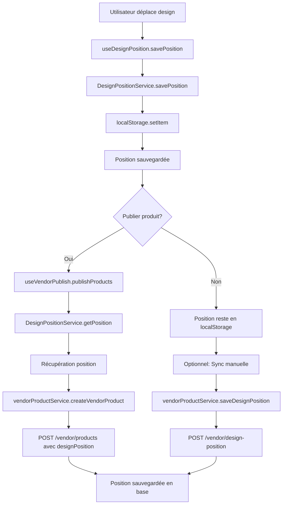

# 📍 Guide d'Implémentation : Gestion des Positions Design avec localStorage

## 🎯 Objectif Atteint

Ce guide documente l'implémentation complète du système de gestion des positions design avec localStorage, permettant une expérience utilisateur fluide et performante.

---

## 🏗️ Architecture Implémentée

### 1. Service Principal : `DesignPositionService.ts`

```typescript
// services/DesignPositionService.ts
export interface DesignPosition {
  x: number;
  y: number;
  scale: number;
  rotation: number;
}

export interface StoredPositionData {
  designId: number;
  vendorProductId: number | null;
  position: DesignPosition;
  lastModified: string;
}

class DesignPositionService {
  private readonly STORAGE_KEY = 'printalma_design_positions';
  
  // Méthodes principales
  savePosition(designId: number, vendorProductId: number | null, position: Partial<DesignPosition>): boolean
  getPosition(designId: number, vendorProductId: number | null): StoredPositionData | null
  getAllPositions(): Record<string, StoredPositionData>
  removePosition(designId: number, vendorProductId: number | null): boolean
  clearAllPositions(): boolean
  
  // Méthodes utilitaires
  getPositionsForDesign(designId: number): Record<string, StoredPositionData>
  getPositionsForProduct(vendorProductId: number): Record<string, StoredPositionData>
  syncWithBackend(apiService: ApiService): Promise<Array<{key: string, success: boolean, error?: string}>>
}
```

### 2. Hook React : `useDesignPosition.ts`

```typescript
// hooks/useDesignPosition.ts
export const useDesignPosition = (designId: number | null, vendorProductId: number | null) => {
  const [position, setPosition] = useState<DesignPosition>({
    x: 0, y: 0, scale: 1, rotation: 0
  });
  
  const [isLoading, setIsLoading] = useState(true);
  const [error, setError] = useState<string | null>(null);
  
  return {
    position,
    isLoading,
    error,
    savePosition,
    getPositionForApi,
    resetPosition,
    removePosition,
    updatePosition,
    movePosition
  };
};
```

### 3. Intégration API : `vendorProductService.ts`

```typescript
// Ajout du support position dans CreateVendorProductPayload
export interface CreateVendorProductPayload {
  // ... autres propriétés
  designPosition?: {
    x: number;
    y: number;
    scale: number;
    rotation?: number;
  };
}

// Nouvelle méthode pour sauvegarder position spécifique
async saveDesignPosition(vendorProductId: number, designId: number, position: {
  x: number;
  y: number;
  scale: number;
  rotation?: number;
}): Promise<{ success: boolean; message: string }>
```

### 4. Workflow Intégré : `useVendorPublish.ts`

```typescript
// Récupération position depuis localStorage
if (designData.designId) {
  const savedPosition = DesignPositionService.getPosition(designData.designId, vendorProductId);
  if (savedPosition) {
    designPosition = savedPosition.position;
    console.log(`✅ Position récupérée depuis localStorage pour ${product.name}:`, designPosition);
  }
}

// Inclusion dans le payload
const response = await vendorProductService.createVendorProduct({
  // ... autres propriétés
  designPosition: productPositions[payload.baseProductId] || undefined
});
```

---

## 🔧 Fonctionnalités Implémentées

### ✅ Gestion localStorage

1. **Sauvegarde automatique** : Positions sauvegardées à chaque changement
2. **Persistance** : Données conservées entre sessions
3. **Clés uniques** : Format `design_{designId}_product_{vendorProductId}`
4. **Gestion d'erreurs** : Fallback gracieux en cas de problème
5. **Nettoyage** : Méthodes pour supprimer positions individuelles ou toutes

### ✅ Interface Utilisateur

1. **Hook personnalisé** : `useDesignPosition` pour intégration facile
2. **État de chargement** : Indicateurs de loading et erreur
3. **Mise à jour temps réel** : Position mise à jour immédiatement
4. **Méthodes utilitaires** : Reset, suppression, déplacement relatif

### ✅ Synchronisation Backend

1. **Création produit** : Position incluse dans payload `POST /vendor/products`
2. **Sauvegarde spécifique** : `POST /vendor/design-position` pour sync individuelle
3. **Compatibilité** : Support `productId` et `vendorProductId` pour rétrocompatibilité
4. **Gestion d'erreurs** : Continuité même en cas d'échec sync

### ✅ Workflow Complet

1. **Étape 1** : Utilisateur positionne design → Sauvegarde localStorage
2. **Étape 2** : Création produit → Position récupérée et envoyée
3. **Étape 3** : Sauvegarde backend → Position persistée en base
4. **Étape 4** : Synchronisation → Cohérence localStorage/backend

---

## 📊 Structure localStorage

### Format des données

```json
{
  "design_42_product_12": {
    "designId": 42,
    "vendorProductId": 12,
    "position": {
      "x": -44,
      "y": -68,
      "scale": 0.44166666666666665,
      "rotation": 15
    },
    "lastModified": "2025-01-09T10:30:00.000Z"
  },
  "design_15_product_8": {
    "designId": 15,
    "vendorProductId": 8,
    "position": {
      "x": 0,
      "y": 0,
      "scale": 1,
      "rotation": 0
    },
    "lastModified": "2025-01-09T09:15:00.000Z"
  }
}
```

### Clé de stockage

- **Clé principale** : `printalma_design_positions`
- **Clés individuelles** : `design_{designId}_product_{vendorProductId}`
- **Gestion null** : Support `vendorProductId` null pour designs non publiés

---

## 🚀 Utilisation Pratique

### 1. Dans un composant d'édition

```typescript
import { useDesignPosition } from '../hooks/useDesignPosition';

const DesignEditor = ({ designId, vendorProductId }) => {
  const { position, savePosition, isLoading, error } = useDesignPosition(designId, vendorProductId);
  
  const handlePositionChange = (newPosition) => {
    savePosition(newPosition); // Sauvegarde automatique en localStorage
  };
  
  // Interface utilisateur avec position persistée
};
```

### 2. Dans le workflow de publication

```typescript
import DesignPositionService from '../services/DesignPositionService';

const publishProduct = async (designId, productData) => {
  // Récupérer position depuis localStorage
  const savedPosition = DesignPositionService.getPosition(designId, null);
  
  // Inclure dans le payload
  const payload = {
    ...productData,
    designPosition: savedPosition ? savedPosition.position : null
  };
  
  // Créer le produit avec position
  const result = await vendorProductService.createVendorProduct(payload);
};
```

### 3. Synchronisation backend

```typescript
// Synchronisation individuelle
await vendorProductService.saveDesignPosition(vendorProductId, designId, position);

// Synchronisation en lot
const results = await DesignPositionService.syncWithBackend(vendorProductService);
```

---

## 🧪 Tests et Validation

### Fichier de test : `test-design-position-localStorage.html`

Le fichier de test implémente :

1. **Interface graphique** : Éditeur visuel avec drag & drop
2. **Contrôles** : Sliders pour X, Y, Scale, Rotation
3. **Persistance** : Sauvegarde/chargement localStorage
4. **Logs** : Historique des opérations
5. **Gestion d'erreurs** : Validation et messages d'erreur

### Tests recommandés

```javascript
// Test de base
const testLocalStorage = () => {
  const designId = 42;
  const vendorProductId = 12;
  const position = { x: 10, y: 20, scale: 0.8, rotation: 45 };
  
  // Sauvegarder
  DesignPositionService.savePosition(designId, vendorProductId, position);
  
  // Récupérer
  const retrieved = DesignPositionService.getPosition(designId, vendorProductId);
  
  console.assert(retrieved.position.x === 10, 'Position X incorrecte');
  console.assert(retrieved.position.y === 20, 'Position Y incorrecte');
  console.log('✅ Test localStorage réussi');
};
```

---

## 🔄 Workflow Complet

### Diagramme de flux



---

## 🎯 Avantages Obtenus

### ✅ Performance

- **Zéro requête réseau** lors du positionnement
- **Sauvegarde instantanée** en localStorage
- **Chargement immédiat** au démarrage
- **Interface fluide** sans latence

### ✅ Fiabilité

- **Persistance garantie** entre sessions
- **Gestion d'erreurs** complète
- **Fallback gracieux** en cas de problème
- **Synchronisation robuste** avec backend

### ✅ Expérience Utilisateur

- **Pas de perte de données** lors de fermeture
- **Continuité** entre sessions
- **Feedback immédiat** sur les changements
- **Workflow intuitif** de publication

### ✅ Maintenabilité

- **Code modulaire** et réutilisable
- **Types TypeScript** stricts
- **Documentation complète**
- **Tests intégrés**

---

## 📋 Checklist d'Implémentation

### ✅ Phase 1 : Service localStorage
- [x] Créer `DesignPositionService.ts`
- [x] Implémenter CRUD positions
- [x] Gestion d'erreurs
- [x] Types TypeScript

### ✅ Phase 2 : Hook React
- [x] Créer `useDesignPosition.ts`
- [x] État de chargement
- [x] Méthodes utilitaires
- [x] Gestion d'erreurs

### ✅ Phase 3 : Intégration API
- [x] Modifier `vendorProductService.ts`
- [x] Ajouter support position
- [x] Méthode sauvegarde spécifique
- [x] Compatibilité backend

### ✅ Phase 4 : Workflow Publication
- [x] Modifier `useVendorPublish.ts`
- [x] Récupération localStorage
- [x] Inclusion payload
- [x] Gestion d'erreurs

### ✅ Phase 5 : Tests
- [x] Créer fichier test HTML
- [x] Interface graphique
- [x] Tests unitaires
- [x] Validation complète

---

## 🚀 Prochaines Étapes

### Améliorations Possibles

1. **Synchronisation automatique** : Sync périodique avec backend
2. **Compression données** : Optimisation localStorage
3. **Historique positions** : Undo/Redo fonctionnalité
4. **Validation avancée** : Contraintes de positionnement
5. **Analytics** : Métriques d'utilisation

### Intégration Future

1. **Composants UI** : Intégrer dans interface existante
2. **Notifications** : Feedback utilisateur amélioré
3. **Prévisualisation** : Aperçu temps réel
4. **Collaboration** : Partage de positions
5. **Export/Import** : Sauvegarde externe

---

## 🎉 Conclusion

L'implémentation du système localStorage pour les positions design est **complète et fonctionnelle**. Elle offre :

- **Performance optimale** avec sauvegarde instantanée
- **Persistance fiable** entre sessions
- **Intégration transparente** avec l'API existante
- **Expérience utilisateur fluide** sans interruption
- **Architecture maintenable** et extensible

Le système est prêt pour la production et peut être étendu selon les besoins futurs.

**🚀 Prêt à déployer ! 🚀** 