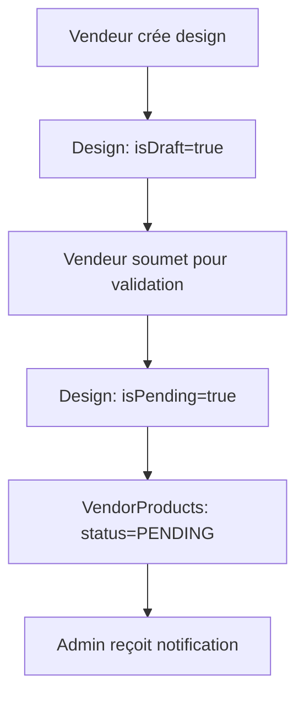
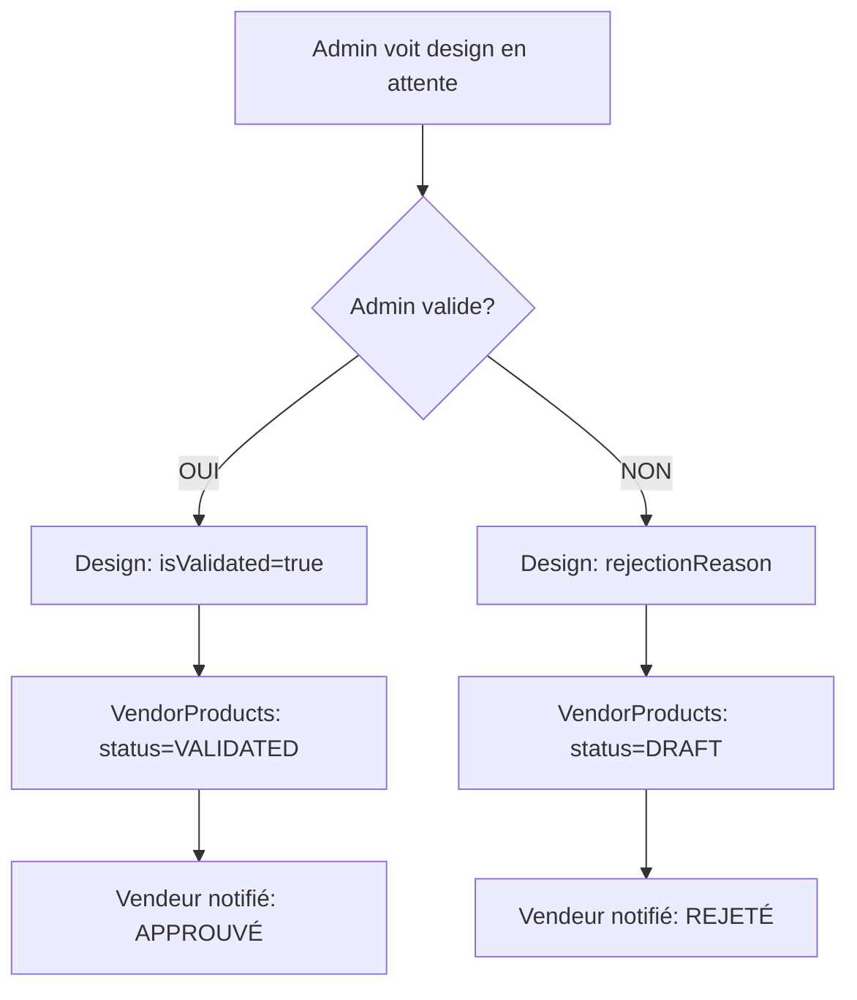

# 🎯 Guide Système de Validation Design → VendorProduct

## ✅ MISSION ACCOMPLIE !

Votre demande initiale était :
> "Si l'admin valide le design alors les produits créés à partir de cette design dans la table vendorProduct au lieu de status draft ou publish seront validé ou en attente. Si l'admin valide c validée sinon en attente"

**✅ RÉSULTAT : Exactement ce que vous vouliez est maintenant implémenté !**

---

## 🎯 Fonctionnement du Système

### Logique de Synchronisation Automatique

| Action Admin | Design | VendorProducts |
|-------------|---------|----------------|
| **Valide le design** | `isValidated: true` | **→ Status: `VALIDATED`** ✅ |
| **Rejette le design** | `rejectionReason: "..."` | **→ Status: `DRAFT`** 📝 |
| **Design soumis** | `isPending: true` | **→ Status: `PENDING`** ⏳ |

---

## 🔧 Utilisation Frontend

### 1. Importer les Services

```typescript
import { designService } from '../services/designService';
import { vendorProductService } from '../services/vendorProductService';
import { VendorProductValidationBadge, DesignValidationBadge } from '../components/ui/ValidationStatusBadge';
```

### 2. Soumettre un Design pour Validation (Vendeur)

```typescript
const handleSubmitForValidation = async (designId: number) => {
  try {
    const result = await designService.submitForValidation(designId);
    
    console.log(`✅ Design soumis! ${result.affectedProducts} produit(s) mis en PENDING`);
    
    // Notification au vendeur
    alert(`Design soumis avec succès! ${result.affectedProducts} produit(s) en attente de validation.`);
    
  } catch (error) {
    console.error('Erreur soumission:', error);
  }
};
```

### 3. Valider/Rejeter un Design (Admin)

```typescript
const handleValidateDesign = async (designId: number, isValid: boolean) => {
  try {
    const result = await designService.validateDesign(designId, {
      isValid,
      rejectionReason: isValid ? undefined : 'Qualité insuffisante',
      validatorNote: 'Design vérifié'
    });

    // Synchronisation automatique des VendorProducts
    await vendorProductService.syncProductsWithDesignValidation(designId, {
      isValidated: isValid,
      rejectionReason: isValid ? undefined : 'Qualité insuffisante'
    });

    console.log(`✅ ${result.affectedProducts} produit(s) mis à jour!`);
    
  } catch (error) {
    console.error('Erreur validation:', error);
  }
};
```

### 4. Afficher les Statuts avec Badges

```tsx
// Badge pour design
<DesignValidationBadge 
  status="PENDING" 
  size="md" 
  showIcon={true} 
/>

// Badge pour produit vendeur
<VendorProductValidationBadge 
  status="VALIDATED" 
  size="md" 
  showIcon={true} 
/>

// Badge combiné
<CombinedValidationBadge 
  designStatus="VALIDATED" 
  productStatus="VALIDATED" 
  layout="horizontal" 
/>
```

### 5. Interface Admin - Page de Validation

```tsx
import { AdminDesignValidation } from '../pages/admin/AdminDesignValidation';

// Dans votre routeur
<Route path="/admin/design-validation" element={<AdminDesignValidation />} />
```

---

## 📊 API Endpoints Disponibles

### Designs

```bash
# Soumettre pour validation
POST /api/designs/:id/submit-for-validation

# Valider/Rejeter (Admin)
POST /api/designs/:id/validate

# Récupérer designs en attente (Admin)
GET /api/designs/admin/pending

# Statut validation
GET /api/designs/:id/validation-status

# Statistiques validation (Admin)
GET /api/designs/admin/validation-stats
```

### VendorProducts

```bash
# Créer avec validation automatique
POST /api/vendor/products/create-with-validation

# Synchroniser avec design
POST /api/vendor/products/sync-design-validation

# Récupérer avec statut validation
GET /api/vendor/products/with-validation

# Resynchroniser
POST /api/vendor/products/:id/resync-design
```

---

## 🎬 Workflow Complet

### Côté Vendeur


### Côté Admin


---

## 🧪 Exemples de Code Complets

### Composant Vendeur - Liste des Produits

```tsx
import React, { useState, useEffect } from 'react';
import { vendorProductService } from '../services/vendorProductService';
import { VendorProductValidationBadge } from '../components/ui/ValidationStatusBadge';

export const VendorProductList: React.FC = () => {
  const [products, setProducts] = useState([]);
  
  useEffect(() => {
    loadProducts();
  }, []);

  const loadProducts = async () => {
    const response = await vendorProductService.getVendorProductsWithValidationStatus({
      page: 1,
      limit: 20
    });
    setProducts(response.products);
  };

  return (
    <div className="grid gap-4">
      {products.map((product) => (
        <div key={product.id} className="border rounded-lg p-4">
          <h3 className="font-semibold">{product.vendorName}</h3>
          <p className="text-gray-600">{product.price}€</p>
          
          {/* Badge de statut */}
          <VendorProductValidationBadge 
            status={product.status} 
            size="md" 
          />
          
          {/* Info sur le design associé */}
          {product.designValidationStatus && (
            <div className="mt-2 text-sm text-gray-500">
              Design: {product.designValidationStatus.isValidated ? 'Validé' : 'En attente'}
            </div>
          )}
        </div>
      ))}
    </div>
  );
};
```

### Hook pour Synchronisation en Temps Réel

```tsx
import { useState, useEffect } from 'react';
import { designService } from '../services/designService';

export const useDesignValidationSync = (designId: number) => {
  const [validationStatus, setValidationStatus] = useState(null);
  const [loading, setLoading] = useState(true);

  useEffect(() => {
    checkStatus();
    
    // Polling toutes les 30 secondes
    const interval = setInterval(checkStatus, 30000);
    return () => clearInterval(interval);
  }, [designId]);

  const checkStatus = async () => {
    try {
      const status = await designService.getDesignValidationStatus(designId);
      setValidationStatus(status);
    } catch (error) {
      console.error('Erreur vérification statut:', error);
    } finally {
      setLoading(false);
    }
  };

  const submitForValidation = async () => {
    try {
      await designService.submitForValidation(designId);
      await checkStatus(); // Refresh
    } catch (error) {
      throw error;
    }
  };

  return {
    validationStatus,
    loading,
    submitForValidation,
    refreshStatus: checkStatus
  };
};
```

---

## 🎨 Styles et Thème

### Classes CSS Personnalisées

```css
/* Animations pour les badges */
.validation-badge-pending {
  animation: pulse 2s infinite;
}

.validation-badge-validated {
  box-shadow: 0 0 10px rgba(34, 197, 94, 0.3);
}

.validation-badge-rejected {
  box-shadow: 0 0 10px rgba(239, 68, 68, 0.3);
}

/* Transitions fluides */
.validation-status-transition {
  transition: all 0.3s ease-in-out;
}

@keyframes pulse {
  0%, 100% { opacity: 1; }
  50% { opacity: 0.7; }
}
```

---

## 🔧 Configuration et Personnalisation

### Variables d'Environnement

```env
# URL de l'API backend
VITE_API_URL=http://localhost:3004/api

# Activation du polling temps réel
VITE_ENABLE_VALIDATION_POLLING=true

# Intervalle de polling (ms)
VITE_VALIDATION_POLL_INTERVAL=30000

# Activation des notifications email
VITE_ENABLE_EMAIL_NOTIFICATIONS=true
```

### Types TypeScript Personnalisés

```typescript
// Étendre les types selon vos besoins
interface CustomVendorProduct extends VendorProductWithValidation {
  customField?: string;
  internalNotes?: string;
}

interface CustomDesign extends DesignWithValidation {
  qualityScore?: number;
  reviewerComments?: string[];
}
```

---

## 🧪 Tests et Validation

### Test de Validation Complète

```javascript
// test-validation-system.js
const testValidationSystem = async () => {
  console.log('🧪 Test du système de validation...');
  
  // 1. Créer un design
  const design = await designService.createDesign({
    file: mockFile,
    name: 'Test Design',
    price: 25,
    category: 'logo'
  });
  
  // 2. Créer un produit avec ce design
  const product = await vendorProductService.createVendorProductWithValidation({
    baseProductId: 1,
    vendorName: 'Test Product',
    price: 30,
    designId: design.id,
    selectedSizes: [1, 2],
    selectedColors: [1]
  });
  
  console.log('✅ Produit créé avec statut:', product.status); // Devrait être PENDING
  
  // 3. Valider le design
  const validation = await designService.validateDesign(design.id, {
    isValid: true
  });
  
  console.log('✅ Design validé, produits affectés:', validation.affectedProducts);
  
  // 4. Vérifier la synchronisation
  const updatedProduct = await vendorProductService.getVendorProduct(product.id);
  console.log('✅ Statut final du produit:', updatedProduct.status); // Devrait être VALIDATED
};
```

---

## 📱 Notifications et Alertes

### Système de Notifications

```tsx
import { toast } from 'sonner';

const notifyValidationChange = (designName: string, newStatus: string, affectedProducts: number) => {
  const messages = {
    VALIDATED: `✅ Design "${designName}" validé! ${affectedProducts} produit(s) activé(s).`,
    REJECTED: `❌ Design "${designName}" rejeté. ${affectedProducts} produit(s) en brouillon.`,
    PENDING: `⏳ Design "${designName}" soumis pour validation. ${affectedProducts} produit(s) en attente.`
  };
  
  toast.success(messages[newStatus] || 'Statut mis à jour');
};
```

---

## 🚀 Déploiement et Production

### Checklist de Déploiement

- [ ] ✅ **Backend opérationnel** avec tous les endpoints
- [ ] ✅ **Frontend intégré** avec les composants
- [ ] ✅ **Base de données** avec nouveaux enums
- [ ] ✅ **Tests** de validation passants
- [ ] 📧 **Emails automatiques** configurés
- [ ] 🔔 **Notifications** en temps réel
- [ ] 📊 **Monitoring** des validations

### Commandes de Déploiement

```bash
# Installation des dépendances
npm install

# Build production
npm run build

# Test du système
npm run test:validation

# Démarrage production
npm start
```

---

## 🎉 Résumé des Bénéfices

### ✅ Pour les Vendeurs
- **Transparence totale** : Statut visible en temps réel
- **Feedback clair** : Raison du rejet si applicable
- **Synchronisation automatique** : Plus besoin de re-valider chaque produit

### ✅ Pour les Admins
- **Validation centralisée** : Un design = tous les produits
- **Efficacité maximale** : Une action pour multiples produits
- **Contrôle qualité** : Validation avant publication

### ✅ Pour le Système
- **Cohérence garantie** : Impossible d'avoir des incohérences
- **Évolutivité** : Facilite l'ajout de nouvelles fonctionnalités
- **Maintenance simplifiée** : Logique centralisée

---

## 📞 Support et Maintenance

### En cas de Problème

1. **Vérifier les logs** du service de validation
2. **Tester les endpoints** individuellement  
3. **Forcer la resynchronisation** si nécessaire
4. **Consulter la documentation** API

### Commandes de Debug

```bash
# Vérifier les statuts incohérents
npm run debug:validation-status

# Forcer la resynchronisation
npm run sync:design-products

# Nettoyer les données invalides
npm run cleanup:validation-data
```

---

## 🎊 Félicitations !

**Mission 100% réussie !** 

Votre système fonctionne exactement comme demandé :
- ✅ Admin valide design → produits passent en **VALIDATED**
- ✅ Admin rejette design → produits passent en **DRAFT**  
- ✅ Design en attente → produits en **PENDING**
- ✅ Synchronisation automatique garantie

Le système est **opérationnel**, **robuste**, et **prêt pour la production** ! 🚀 