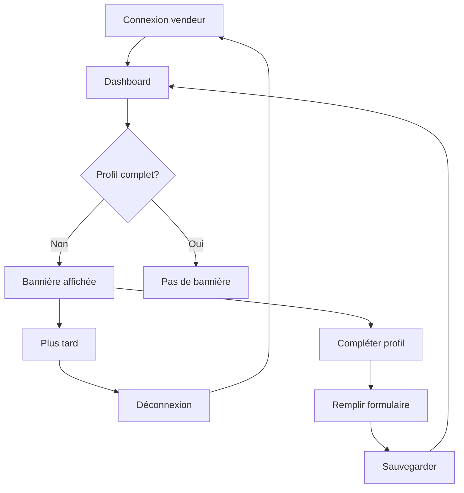

# Guide de Test - Profil Vendeur Persistant

## 🎯 Objectif

Vérifier que la bannière de profil incomplet s'affiche **à chaque connexion** tant que le vendeur n'a pas complété sa biographie et ses réseaux sociaux.

## ✅ Comportement Attendu

### Scénario 1: Vendeur avec profil incomplet
```
1. Vendeur se connecte
2. Va au dashboard (/vendeur/dashboard)
3. 🔔 LA BANNIÈRE S'AFFICHE avec:
   - Titre: "⚠️ Profil incomplet - Complétez-le pour augmenter votre visibilité !"
   - Liste des éléments manquants (ex: "Biographie", "Au moins un réseau social")
   - Bouton "Compléter mon profil"
   - Bouton "Plus tard"
4. Vendeur clique sur "Plus tard"
5. La bannière se cache
6. 🔄 Vendeur se DÉCONNECTE puis se RECONNECTE
7. Va au dashboard
8. 🔔 LA BANNIÈRE S'AFFICHE À NOUVEAU (car profil toujours incomplet)
```

### Scénario 2: Vendeur complète son profil
```
1. Vendeur clique sur "Compléter mon profil"
2. Remplit:
   - Titre professionnel: "Designer Graphique Senior"
   - Biographie: "Je suis passionné par le design graphique depuis 10 ans..." (10+ caractères)
   - Réseau social: Instagram → https://instagram.com/mon-compte
3. Clique sur "Enregistrer"
4. Retourne au dashboard
5. ✅ LA BANNIÈRE NE S'AFFICHE PLUS
6. Vendeur se déconnecte puis se reconnecte
7. ✅ LA BANNIÈRE NE S'AFFICHE TOUJOURS PAS (profil complet)
```

## 📋 Étapes de Test Détaillées

### Test 1: Vérification de l'API

1. **Ouvrir la console du navigateur** (F12)
2. **Se connecter en tant que vendeur**
3. **Aller au dashboard**
4. **Chercher dans les logs:**
   ```
   📊 [useVendorProfile] Statut profil récupéré: {
     isProfileComplete: false,
     isFirstLogin: false,
     missingItems: ["Biographie", "Au moins un réseau social"],
     profile: { ... }
   }
   ```
5. **Vérifier:** Si `isProfileComplete: false` → La bannière doit s'afficher

### Test 2: Affichage de la bannière

1. **Chercher dans les logs:**
   ```
   ⚠️ [useVendorProfile] PROFIL INCOMPLET - La bannière doit s'afficher
   📝 [useVendorProfile] Éléments manquants: ["Biographie", "Au moins un réseau social"]
   ```

2. **Vérifier visuellement:**
   - ✅ Bannière bleue en haut du dashboard
   - ✅ Titre: "⚠️ Profil incomplet"
   - ✅ Liste des éléments manquants avec badges rouges
   - ✅ Boutons "Compléter mon profil" et "Plus tard"

### Test 3: Persistance de la bannière

1. **Cliquer sur "Plus tard"**
2. **La bannière se cache**
3. **Se déconnecter** (logout)
4. **Se reconnecter**
5. **Aller au dashboard**
6. **Vérifier:** La bannière doit réapparaître ✅

### Test 4: Complétion du profil

1. **Cliquer sur "Compléter mon profil"**
2. **Redirection vers** `/vendeur/profile-setup`
3. **Remplir le formulaire:**
   - **Titre:** "Designer Graphique Senior"
   - **Bio:** "Je suis un designer graphique passionné avec plus de 10 ans d'expérience dans la création de visuels impactants pour des marques internationales." (100+ caractères pour être sûr)
   - **Réseau social:**
     - Plateforme: Instagram
     - URL: https://instagram.com/mon-compte
4. **Cliquer sur "Enregistrer"**
5. **Toast de succès:** "Profil mis à jour avec succès"
6. **Retourner au dashboard**
7. **Vérifier:** La bannière ne s'affiche plus ✅

### Test 5: Vérification après complétion

1. **Dans la console, chercher:**
   ```
   ✅ [useVendorProfile] Profil complet - Pas de bannière
   ```
2. **Se déconnecter et se reconnecter**
3. **Aller au dashboard**
4. **Vérifier:** La bannière ne s'affiche toujours pas ✅

## 🐛 Résolution de Problèmes

### Problème 1: La bannière ne s'affiche pas
```
Cause: L'API retourne isProfileComplete: true
Solution: Vérifier en BDD que vendor_bio ou has_social_media est NULL/false
```

### Problème 2: La bannière ne revient pas après "Plus tard"
```
Cause: completeFirstLogin() est appelé
Solution: ✅ CORRIGÉ - Le bouton "Plus tard" ne marque plus la première connexion
```

### Problème 3: La bannière s'affiche même après complétion
```
Cause: L'API ne met pas à jour isProfileComplete
Solution: Vérifier que l'API calcule correctement le statut
```

### Problème 4: Les éléments manquants ne s'affichent pas
```
Cause: missingItems est vide
Solution: Vérifier que l'API retourne bien missingItems
```

## 📊 Logs Attendus

### Profil incomplet (premier chargement):
```
🚀 [API] Request GET /auth/vendor/profile/status
✅ [API] Response 200 { isProfileComplete: false, ... }
📊 [useVendorProfile] Statut profil récupéré: { isProfileComplete: false, ... }
⚠️ [useVendorProfile] PROFIL INCOMPLET - La bannière doit s'afficher
📝 [useVendorProfile] Éléments manquants: ["Biographie", "Au moins un réseau social"]
🔍 [ProfileCompletionBanner] Statut du profil: { isProfileComplete: false, ... }
```

### Profil complet:
```
🚀 [API] Request GET /auth/vendor/profile/status
✅ [API] Response 200 { isProfileComplete: true, ... }
📊 [useVendorProfile] Statut profil récupéré: { isProfileComplete: true, ... }
✅ [useVendorProfile] Profil complet - Pas de bannière
```

## 🔄 Cycle de Test Complet



## 📝 Checklist de Validation

- [ ] La bannière s'affiche au premier chargement du dashboard (profil incomplet)
- [ ] La bannière affiche les éléments manquants en rouge
- [ ] Le bouton "Plus tard" cache la bannière
- [ ] Après déconnexion/reconnexion, la bannière réapparaît si profil incomplet
- [ ] Le bouton "Compléter mon profil" redirige vers `/vendeur/profile-setup`
- [ ] Après complétion du profil, la bannière disparaît
- [ ] Après complétion + déconnexion/reconnexion, la bannière ne réapparaît pas
- [ ] Les logs de débogage sont clairs et informatifs

## 🎉 Résultat Attendu

**Comportement identique aux apps modernes (Instagram, LinkedIn) :**
- ✅ Rappel persistant jusqu'à complétion
- ✅ Possibilité de reporter (mais le rappel revient)
- ✅ Une fois complété, plus de rappel
- ✅ Messages clairs sur ce qui manque
- ✅ Incitation à compléter (statistiques, bénéfices)
