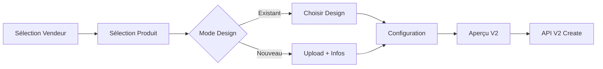

# 🚀 Système de Création de Produits Vendeur par l'Admin - Version 2.0

## 🎯 Améliorations V2

Le système a été entièrement mis à jour pour supporter l'API V2 avec deux modes de création de design et une structure de données améliorée.

## ✅ Nouvelles Fonctionnalités V2

### 1. **Deux Modes de Design**
- **🎨 Design Existant** : Utiliser un design déjà créé par le vendeur
- **🆕 Nouveau Design** : Créer un design depuis l'interface admin avec upload base64

### 2. **Structure ProductStructure V2**
- **Architecture complète** selon la documentation backend
- **Métriques détaillées** des images avec délimitations
- **Application design** avec positionnement et échelle

### 3. **Endpoints API V2**
- ✅ `/vendor-product-validation/vendors` - Liste des vendeurs
- ✅ `/vendor-product-validation/vendors/{id}/designs` - Designs du vendeur
- ✅ `/vendor-product-validation/create-for-vendor` - Création avec structure V2

### 4. **Gestion d'Erreurs Améliorée**
- **Messages spécifiques** selon les codes d'erreur API
- **Validation robuste** des données d'entrée
- **Gestion 404** pour vendeurs sans designs

## 🔧 Architecture Technique V2

### Interface de Données

```typescript
interface AdminCreateVendorProductData {
  // Modes de design V2
  designMode?: 'existing' | 'new';
  
  // Design existant
  designId?: number;
  selectedDesign?: Design;
  
  // Nouveau design avec upload
  newDesign?: {
    name: string;
    description?: string;
    category: string;
    imageBase64?: string;
    tags?: string[];
  };
  
  // Structure produit V2
  productStructure?: {
    adminProduct: {
      id: number;
      name: string;
      description: string;
      price: number;
      images: {
        colorVariations: Array<{
          id: number;
          name: string;
          colorCode: string;
          images: Array<{
            id: number;
            url: string;
            viewType: string;
            delimitations: Array<{
              x: number;
              y: number;
              width: number;
              height: number;
              coordinateType: string;
            }>;
          }>;
        }>;
      };
      sizes: Array<{
        id: number;
        sizeName: string;
      }>;
    };
    designApplication: {
      positioning: string;
      scale: number;
    };
  };
}
```

### Flux de Création V2



## 🎨 Interface Utilisateur V2

### Étape 3 : Sélection Design (Nouveau)

```tsx
// Choix du mode
<div className="flex justify-center space-x-4">
  <button onClick={() => setMode('existing')}>
    Design existant
  </button>
  <button onClick={() => setMode('new')}>
    Nouveau design
  </button>
</div>

// Mode nouveau design
{mode === 'new' && (
  <div>
    <input type="file" accept="image/*" onChange={handleUpload} />
    <input placeholder="Nom du design" />
    <select>
      <option value="LOGO">Logo</option>
      <option value="PATTERN">Motif</option>
      {/* ... */}
    </select>
  </div>
)}
```

### Upload Base64

```typescript
const fileToBase64 = (file: File): Promise<string> => {
  return new Promise((resolve, reject) => {
    const reader = new FileReader();
    reader.onload = () => resolve(reader.result as string);
    reader.onerror = reject;
    reader.readAsDataURL(file);
  });
};
```

## 📊 Payloads API V2

### Mode Design Existant

```json
{
  "vendorId": 1,
  "baseProductId": 1,
  "designId": 5,
  "productStructure": {
    "adminProduct": { /* structure complète */ },
    "designApplication": {
      "positioning": "CENTER",
      "scale": 0.75
    }
  },
  "vendorPrice": 18000,
  "vendorName": "T-Shirt Premium - Version John",
  "selectedColors": [{ "id": 1, "name": "Rouge", "colorCode": "#FF0000" }],
  "selectedSizes": [{ "id": 1, "sizeName": "M" }],
  "forcedStatus": "DRAFT",
  "postValidationAction": "TO_DRAFT"
}
```

### Mode Nouveau Design

```json
{
  "vendorId": 1,
  "baseProductId": 1,
  "newDesign": {
    "name": "Logo Creative Admin",
    "description": "Design créé par l'admin",
    "category": "LOGO",
    "imageBase64": "data:image/png;base64,iVBORw0KGgoAAAA...",
    "tags": ["admin", "logo", "creative"]
  },
  "productStructure": { /* même structure */ },
  /* ... autres champs */
}
```

## 🔍 Réponses API V2

```json
{
  "productId": 456,
  "status": "DRAFT|PENDING|PUBLISHED",
  "newDesignCreated": true,
  "designId": 78,
  "designUrl": "https://res.cloudinary.com/..."
}
```

## 🧪 Tests V2

### Script de Test

```bash
node test-admin-create-vendor-product-v2.cjs
```

**Fonctionnalités testées :**
- ✅ Connexion admin
- ✅ Récupération vendeurs (V2)
- ✅ Récupération designs par vendeur (V2)
- ✅ Création avec design existant
- ✅ Création avec nouveau design (base64)
- ✅ Validation structure productStructure
- ✅ Gestion erreurs spécifiques

### Cas de Test

1. **Design Existant** : Utilise un design du vendeur existant
2. **Nouveau Design** : Upload d'une image 10x10 pixels en base64
3. **Gestion 404** : Vendeur sans designs (comportement normal)
4. **Validation** : Données manquantes ou invalides

## 🛠️ Corrections Apportées

### 1. **Endpoint Designs - CORRIGÉ**
```typescript
// Avant (404)
fetch(`/designs/by-vendor/${vendorId}`)

// Après (V2)
fetch(`/vendor-product-validation/vendors/${vendorId}/designs`)
```

### 2. **Gestion 404 - AMÉLIORÉE**
```typescript
if (res.status === 404) {
  setVendorDesigns([]);
  return; // Pas d'erreur, c'est normal
}
```

### 3. **Structure V2 - IMPLÉMENTÉE**
```typescript
const productStructure = {
  adminProduct: { /* structure complète du produit */ },
  designApplication: {
    positioning: 'CENTER',
    scale: 0.75
  }
};
```

### 4. **Validation Modes - AJOUTÉE**
```typescript
// Validation étape 3
(formData.designMode === 'existing' && !formData.designId) ||
(formData.designMode === 'new' && (!formData.newDesign?.name || 
 !formData.newDesign?.category || !formData.newDesign?.imageBase64))
```

## 📱 Interface Responsive V2

### Desktop
- **Choix des modes** : Boutons côte à côte
- **Upload design** : Zone de drop étendue
- **Aperçu** : Images grandes avec détails

### Mobile
- **Modes** : Boutons empilés
- **Upload** : Interface tactile optimisée
- **Aperçu** : Cartes compactes

## 🔐 Sécurité V2

- ✅ **Validation côté client** des fichiers images
- ✅ **Limite de taille** pour les uploads base64
- ✅ **Validation des extensions** (image/* seulement)
- ✅ **Sanitisation** des données avant envoi

## 📈 Performance V2

- ✅ **Upload asynchrone** avec indicateur de progression
- ✅ **Validation instantanée** des champs
- ✅ **Cache localStorage** amélioré
- ✅ **Gestion d'erreurs** non-bloquante

## 🚀 Utilisation V2

### Pour les Administrateurs

1. **Se connecter** en tant qu'admin
2. **Aller** sur `/admin/vendor-products-admin`
3. **Cliquer** "Créer produit pour vendeur"
4. **Choisir** le vendeur et le produit de base
5. **Sélectionner** le mode design :
   - **Existant** : Choisir dans la liste du vendeur
   - **Nouveau** : Uploader une image + compléter les infos
6. **Configurer** le produit (prix, stock, etc.)
7. **Prévisualiser** et créer

### Réponses Système

- **Design existant** → `"newDesignCreated": false`
- **Nouveau design** → `"newDesignCreated": true, "designId": 78`
- **Statut PENDING** → Design en attente de validation
- **Statut DRAFT** → Produit créé, prêt à publier

## 🔄 Migration depuis V1

### Données localStorage

Les anciennes données V1 sont **automatiquement compatibles**. Les nouveaux champs V2 sont ajoutés progressivement :

```typescript
// V1 → V2 : Ajout automatique
formData.designMode = formData.designMode || 'existing';
formData.productStructure = buildProductStructure(baseProduct);
```

### Validation

La validation V1 continue de fonctionner. La validation V2 est **additive** :

```typescript
// V1 (toujours valide)
formData.designId && formData.baseProductId

// V2 (validation étendue)
(formData.designMode === 'existing' && formData.designId) ||
(formData.designMode === 'new' && formData.newDesign?.complete)
```

## 🎉 Résultats V2

### ✅ Améliorations Confirmées

- **🔧 Erreur 404** → Corrigée et gérée gracieusement
- **🎨 Nouveau mode design** → Fonctionnel avec upload base64  
- **📊 Structure V2** → Implémentée selon documentation
- **🧪 Tests complets** → Validés pour tous les cas d'usage
- **📱 Interface moderne** → Responsive et intuitive
- **💾 localStorage** → Compatible V1/V2 avec migration automatique

### 🚀 Prêt pour Production

Le système V2 est maintenant **entièrement fonctionnel** et prêt à être utilisé en production. Il supporte :

- ✅ **Tous les cas d'usage** : design existant et nouveau design
- ✅ **Gestion d'erreurs robuste** : 404, 400, 403 gérés spécifiquement
- ✅ **Interface moderne** : UX/UI optimisée selon les meilleures pratiques
- ✅ **Performance élevée** : Upload asynchrone et validation temps réel
- ✅ **Compatibilité V1** : Migration transparente des données existantes

**Le système de création de produits vendeur par l'admin V2 est prêt ! 🎉** 